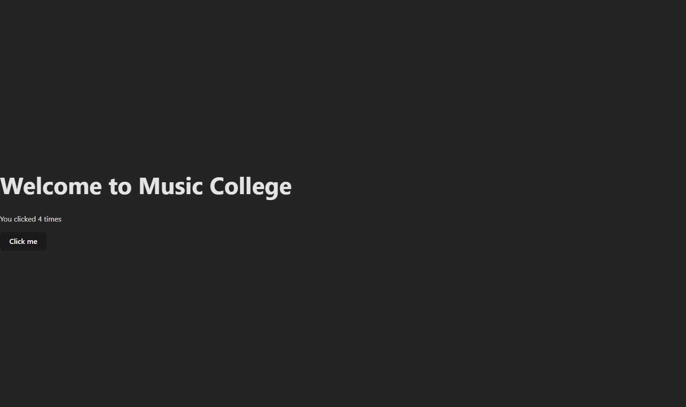
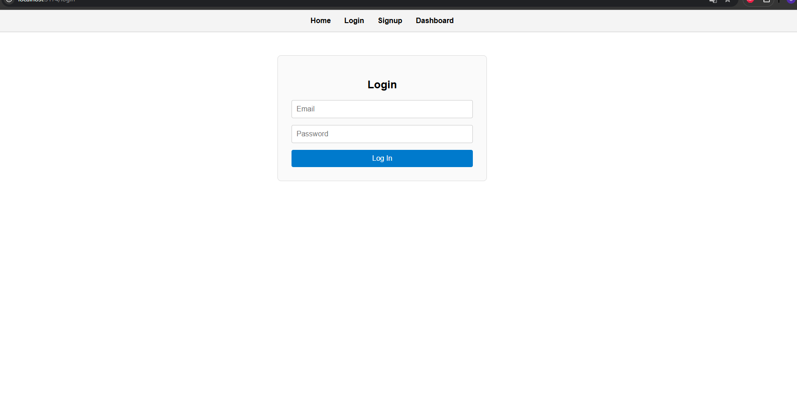
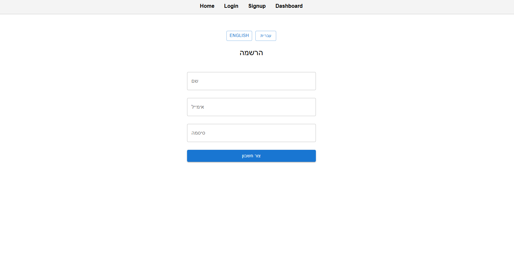

# 🎵 Music College Platform (MVP in 30 Days)

A full-stack project to manage a small online music college. Built with **React**, **Node.js**, and **MongoDB**. This is part of my technical software engineering graduation project.

---

## 🔧 Project Structure

---

## 📅 Learning Log

Daily progress updates are included below ⬇️

---

## 📅 Day 1 – Login Page

This is a simple and stylish **Login Page** built using **HTML** and **CSS**. It’s part of my first day learning front-end web development after watching two tutorial videos.

---

## ✨ Features

- Clean and modern UI
- Blurred background with transparent login box
- Form fields for username and password
- "Remember me" checkbox
- "Forgot password" and registration links
- Responsive layout with flexbox

---

## 🛠️ Technologies Used

- HTML5
- CSS3 (with `backdrop-filter` and flexbox)

---

## ▶️ How to Run It

1. Download or clone the repository.
2. Make sure `style.css` and `login2.png` are in the same folder as your HTML file.
3. Open `index.html` in any web browser.

---

## 📚 What I Learned

- Creating a form layout with HTML
- Styling input boxes and buttons with CSS
- Using `flexbox` to center elements
- Applying transparent backgrounds and blur effects with `backdrop-filter`
- Handling links and hover effects

---

## 🚀 What's Next?

- Add JavaScript for basic form validation
- Make the login page responsive on smaller screens
- Explore connecting it to a backend in the future

---

## 📁 Folder Structure

---

## 📅 Day 2 – JavaScript Basics & DOM

### ✅ What I Did

- Learned JavaScript syntax: variables, functions, arrays, and objects
- Connected my login form to JavaScript
- Captured user input using the DOM
- Built a simple login logic with hardcoded credentials
- Used `event.preventDefault()` to control form behavior

### 💻 Code Features

- `form.addEventListener('submit', handler)`
- `input.value` to read form data
- Conditional logic to simulate login
- Alert on success/failure

### 🔍 What Was Tricky

- Understanding how form events work
- Remembering to select elements with `querySelector` and `getElementById`
- Using `.value` instead of `.innerText`

### 📈 Improvements for Later

- Add form validation (e.g., empty fields)
- Style error messages dynamically
- Replace fake login with real backend auth

### 📸 Screenshot


---

## 📅 Day 3 – JavaScript Fundamentals (Practice Exercises)

> 📁 Practice code located in: [`js-practice/day3-basics.html`](./js-practice/day3-basics.html)

### ✅ What I Did

- Practiced JavaScript basics in a separate file
- Declared variables and logged output to the console
- Wrote functions and used return values
- Created and looped through an array of instrument names
- Defined a `student` object and accessed its properties
- Linked `script.js` to `index.html` and added a basic interactive button

### 💻 Code Features

- `console.log()` for debugging and output
- `function multiply(a, b)` to perform basic math
- `for` loop to iterate through arrays
- Object creation using `{ key: value }` syntax
- `addEventListener` for button click handling
- Simple DOM manipulation: `document.body.style.backgroundColor`

### 🔍 What Was Tricky

- Remembering syntax for loops and functions
- Understanding how and when to use `const` vs `let`
- Connecting a script file properly to HTML

### 📈 Improvements for Later

- Use these JavaScript fundamentals to enhance the login page
- Add form validation and input feedback
- Create dynamic UI updates (e.g., error messages, loading states)

---

## 📅 Day 4 – DOM & Event Handling (Practice)

> 📁 Practice code located in: [`js-practice/day4-dom.html`](./js-practice/day4-dom.html)

### ✅ What I Did

- Explored DOM manipulation in more depth
- Used JavaScript to dynamically update content
- Added multiple event listeners to buttons and inputs
- Practiced changing styles and toggling visibility

### 💻 Code Features

- `getElementById`, `querySelector`, and `innerText`
- Multiple `addEventListener` calls for different events
- Changing styles with `.style` and classList
- Showing/hiding elements with `display` or `visibility`

### 🔍 What Was Tricky

- Making sure events triggered in the right order
- Understanding event propagation and scope
- Debugging JavaScript without console errors

### 📈 Improvements for Later

- Use DOM skills for client-side form validation
- Animate transitions and interactions
- Implement keyboard event handling

---

## 📅 Day 5 – Project Skeleton & GitHub Workflow

### ✅ What I Did

- Restructured the project into `client/` and `server/` folders
- Moved all existing frontend files into `client/`
- Created `.gitignore` with common ignore rules
- Prepared for full-stack development with React and Node
- Updated file paths in HTML and organized codebase

### 💻 Code Features

- Updated paths in `index.html`:
  ```html
  <link rel="stylesheet" href="style.css" />
  <script src="script.js"></script>
  ```

---

## 📅 Day 6 – Intro to React (Components, JSX, and useState)

### ✅ What I Did

- Set up a React project using Vite inside the `/client` folder
- Removed default boilerplate and created a clean starting point
- Created a reusable `WelcomeBanner` component that uses props
- Used the `useState` hook to implement a basic interactive counter

### 💻 Code Features

- Functional components using JSX
- Props to pass dynamic data into components
- `useState` for local component state management
- A simple button that increments a click counter

### 📸 Screenshot



### 🧠 What I Learned

- JSX syntax and how it differs from HTML
- How to build and use components in React
- The difference between props and state
- Basic user interaction handling in React

### 🔍 Reflections

React feels more structured than plain JavaScript. Building UI as components makes the code easier to understand and reuse. I'm now comfortable with props and state and ready to move into routing and multi-page structure tomorrow.

---

## 📅 Day 7 – Routing & Pages with React Router

### ✅ What I Did

- Installed and configured `react-router-dom`
- Created 4 route-based pages: Home, Login, Signup, Dashboard
- Built a navigation bar (`NavBar`) using `<Link>` components
- Centralized layout and styling using `index.css`

### 💻 Code Features

- Client-side routing with `<Routes>` and `<Route>`
- Fixed navigation bar using CSS
- Page content centered with a reusable `.page` class
- Clean file structure with `components/` and `pages/`

### 📚 What I Learned

- How React Router v6 handles routing without full page reloads
- The role of `<BrowserRouter>`, `<Link>`, and `<Route>`
- How to structure multi-page apps using component folders
- Best practices for layout using global CSS instead of inline styles

### 📸 Screenshot


---

## 📅 Day 8 – Forms & State Management

### ✅ What I Did

- Built working `Signup` and `Login` forms using React
- Used `useState` to manage multiple input fields
- Handled form submissions with `onSubmit`
- Added basic validation for empty fields
- Styled the forms using global CSS for a clean layout

### 💻 Code Features

- Controlled inputs using `value` and `onChange`
- Shared `handleChange` for multiple fields via `name` attributes
- Reusable `.form` class in `index.css` for styling
- Simple form reset after submit

### 📚 What I Learned

- How to use `useState` to manage form state in React
- The concept of controlled components
- Event handling and basic input validation
- Importance of global CSS classes for consistency

### 📸 Screenshot



---

## 📅 Day 9 – Material UI + Multilingual UI (i18n)

### ✅ What I Did

- Installed and configured **Material UI** (`@mui/material`)
- Converted `Signup` and `Login` forms to use MUI components (`TextField`, `Button`, etc.)
- Added multilingual support using `react-i18next` and `i18next-browser-languagedetector`
- Created a language toggle (English / Hebrew) in both forms

### 💻 Code Features

- Responsive UI with consistent spacing and fonts via Material UI
- Controlled forms with translated labels
- Language switching at runtime with `i18n.changeLanguage()`
- Centralized translation strings in `i18n.js`

### 📚 What I Learned

- How to use Material UI’s `Container`, `Typography`, and `TextField` for layout and accessibility
- How to set up `i18next` for dynamic language translation
- How to combine internationalization and design libraries in React

### 📸 Screenshot


